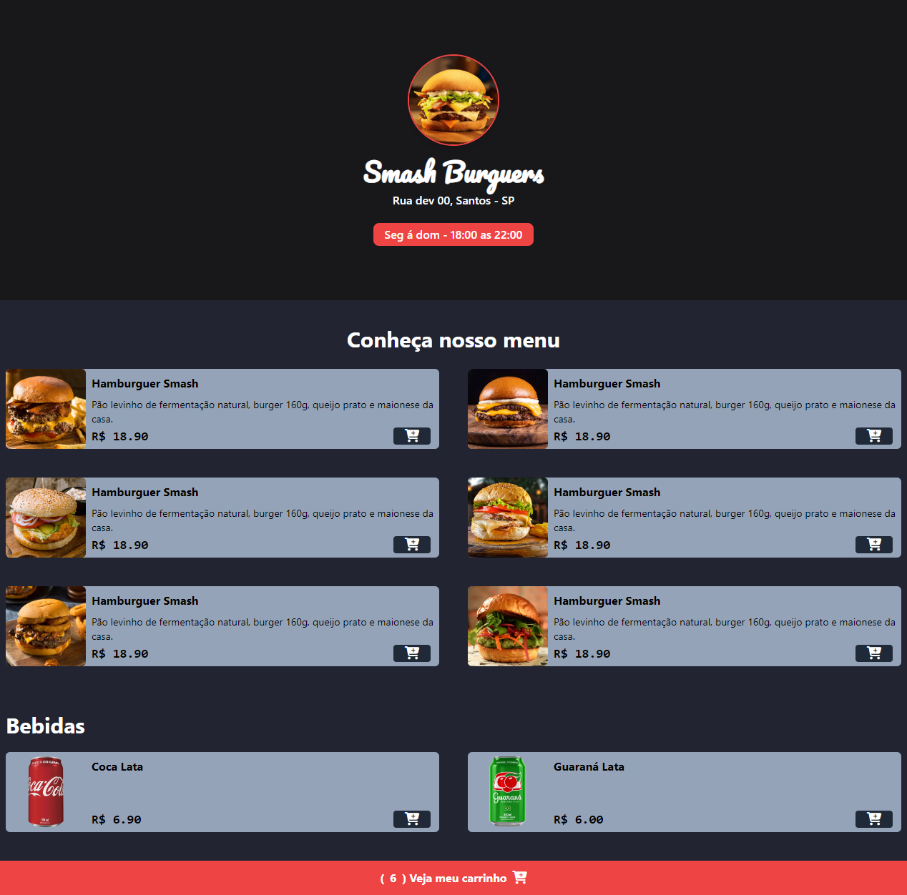
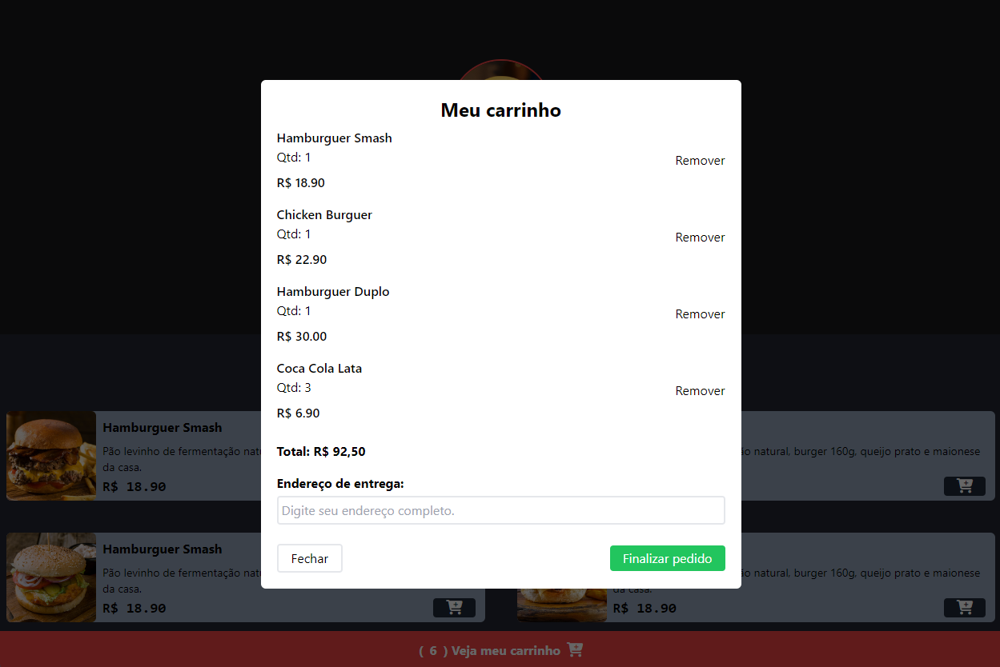

# Smash Burgers - Hamburgueria
Bem-vindo ao repositório do projeto "Smash Burgers". Este é um site simples e responsivo de uma hamburgueria, onde os clientes podem visualizar o menu e adicionar itens ao carrinho. O projeto foi desenvolvido utilizando HTML, CSS, JavaScript e algumas bibliotecas externas para melhorar a experiência do usuário.

# Funcionalidades
- **Menu de Produtos:** Exibição de hamburgueres e bebidas com imagens, descrições e preços.
- **Carrinho de Compras:** Os usuários podem adicionar itens ao carrinho usando um botão em cada produto.
- **Design Responsivo:** O site é totalmente responsivo, garantindo uma boa experiência em diferentes tamanhos de tela.
- **Efeitos Visuais:** Utilização de animações e efeitos para melhorar a interação do usuário com o site.

# Tecnologias Utilizadas
- **HTML5:** Estrutura básica do site.
- **CSS3 (Tailwind CSS):** Estilização e layout responsivo.
- **JavaScript:** Manipulação de eventos e interatividade.
- **Toastify.js:** Exibição de notificações visuais.
- **Font Awesome:** Ícones personalizados para melhorar a interface.
- **Google Fonts (Quicksand):** Fonte utilizada no projeto.








# Estrutura de Pastas

```
/assets          # Imagens usadas no projeto (hamburgueres, bebidas, etc).
/styles          # Arquivos CSS (Tailwind CSS).
/scripts         # Scripts JavaScript (lógica de adição ao carrinho e interação).
```

# Como Rodar o Projeto
- Clone este repositório:

```
git clone https://github.com/seu-usuario/smash-burgers.git
```

- Abra o arquivo index.html no seu navegador preferido.

- Navegue pelo site, adicione itens ao carrinho e veja as notificações visuais.

# Bibliotecas Externas
- Tailwind CSS
- Toastify.js
- Font Awesome
  
# Contribuição
Contribuições são bem-vindas! Sinta-se à vontade para abrir issues ou pull requests.

# Licença
Este projeto está licenciado sob a licença MIT. Consulte o arquivo LICENSE para mais detalhes.


